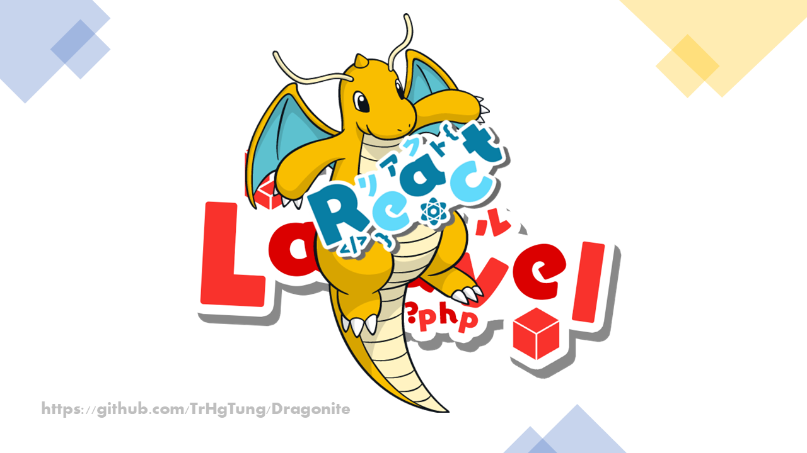
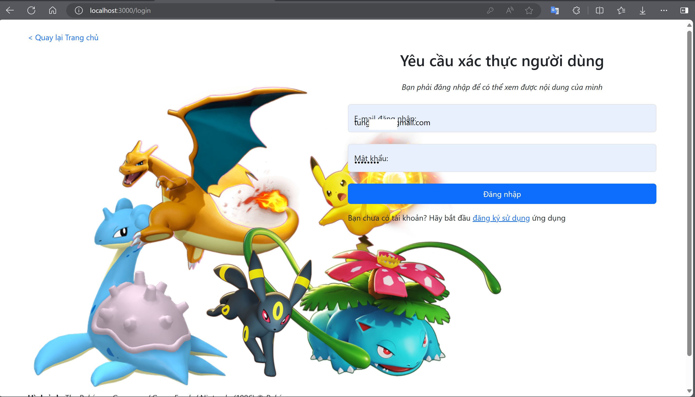
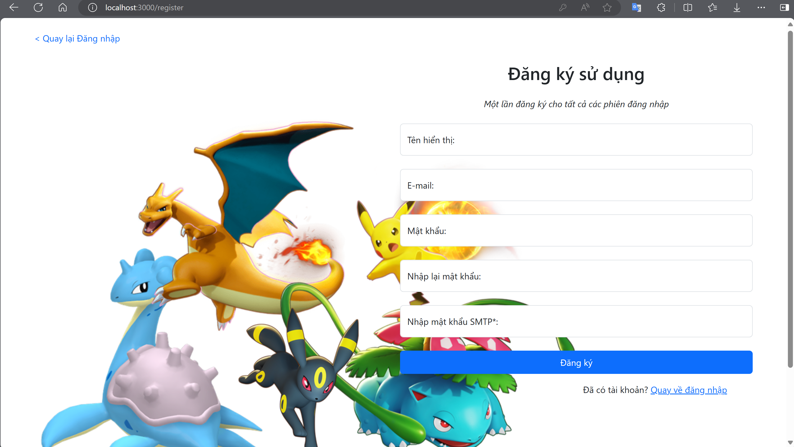
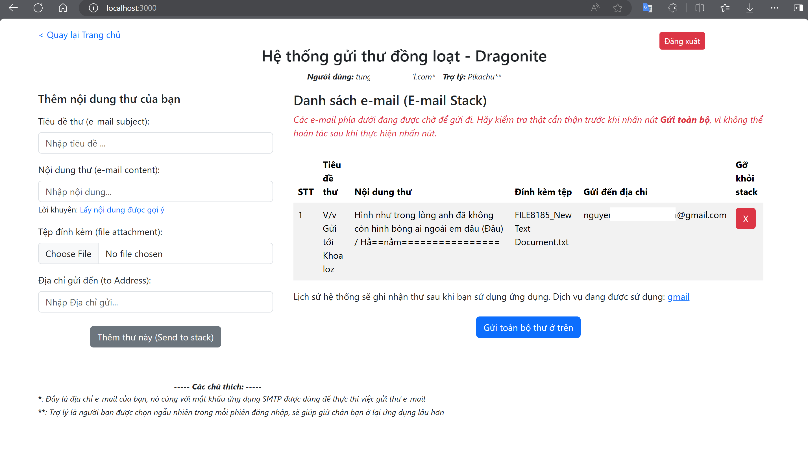
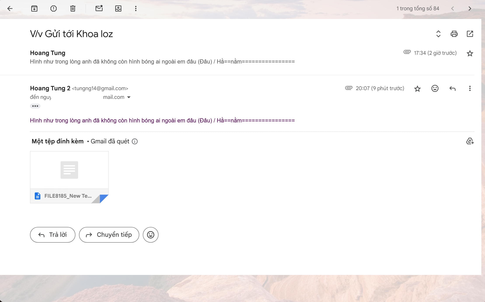
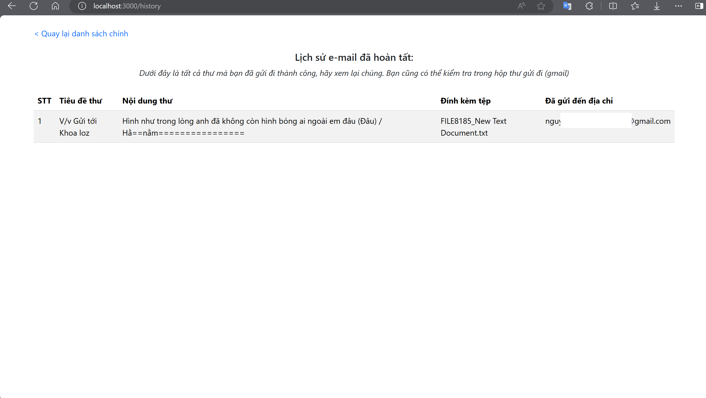
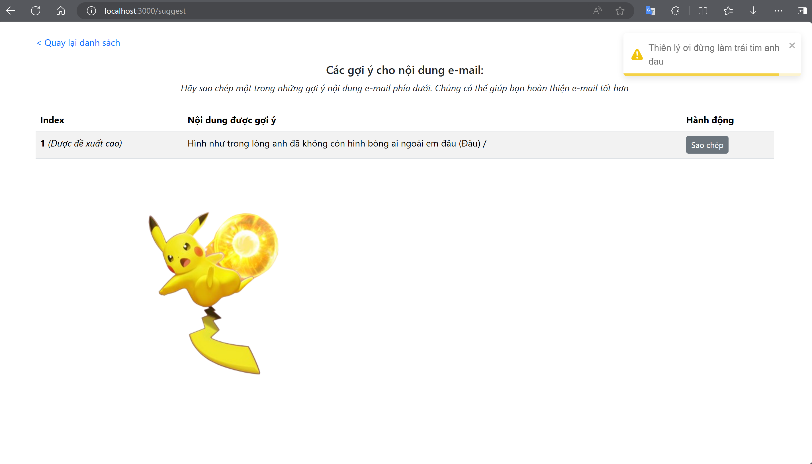

<h1>Dragonite - Một ứng dụng gửi thư điện tử đồng loạt với Laravel và ReactJS</h1>
<h2>GIỚI THIỆU</h2>

<h6>Phiên bản: 1.1</h6>

Một hệ thống nhằm lưu trữ nhiều nội dung thư điện tử theo danh sách và cho phép gửi đi đồng loạt 

- Tác quyền:  

  - Hình ảnh & thương hiệu (Pokémon): The Pokémon Company / Game Freak / Nintendo (1996)  

  - Thiết kế ứng dụng & viết mã: Hoàng Tùng  
  - Kịch bản & thiết kế tệp README / tài liệu hướng dẫn: Hoàng Tùng   

 

- Chủ thể: Người dùng  
- Kiến trúc phần mềm: Kiến trúc phân tán (Distributed Architecture)  

<h4>❗Ver. 1.1:</h5>

- Sửa lỗi kiểm tra phiên của người dùng
- Thay đổi cách hiển thị dữ liệu trong Đề xuất
- Thay đổi thẻ a thành thẻ Link (component của React Router) để thể hiện tính chất ứng dụng đơn trang (Single Page App.)

 

<h2>CÁC CÔNG NGHỆ NỔI BẬT</h2>
1. <b> Laravel </b>:  
- Tài liệu: https://laravel.com/  
- Tham khảo: ChatGPT (https://chat.openai.com/), StackOverFlow (https://stackoverflow.com/), Laracasts (https://laracasts.com/)   
2. <b> ReactJS</b>:  
- Tài liệu: https://react.dev/learn  
- Trang chủ: https://react.dev/  
- Tham khảo: ChatGPT (https://chat.openai.com/), StackOverFlow (https://stackoverflow.com/)  

<h2>CÁC TÍNH NĂNG NỔI BẬT</h2>
<h4>Phía Người dùng:</h4>

1. Đăng nhập, đăng ký, đăng xuất (Sử dụng Bearer Token để xác thực và Sanctum Laravel để lưu phiên đăng nhập người dùng) 
2. Lưu lại các thư điện tử và gom chúng lại thành một danh sách, mỗi danh sách thuộc về từng người dùng khác nhau.  
3. Gửi đi đồng loạt các thư trong danh sách, sử dụng giao thức mạng SMTP và thư viện PHPMailer. 

> Xem chi tiết [ở đây](##MÔ-TẢ-CHỨC-NĂNG)

## LUỒNG NGƯỜI DÙNG (USE-CASE)

` Với vai trò là một người dùng bình thường`

1. Xác thực người dùng:  
   1.1. Nếu đã có tài khoản: đăng nhập  
   1.2. Nếu chưa có tài khoản: đăng ký, yêu cầu cung cấp mật khẩu ứng dụng của <a href="https://myaccount.google.com/apppasswords" target="_blank"> tài khoản Google</a> (để cấp cấu hình cho PHPMailer và SMTP) 
2. Thêm thư mới: yêu cầu điền đủ thông tin của một thư (tiêu đề, nội dung - bắt buộc, tệp đính kèm, địa chỉ gửi đến - bắt buộc), sau đó nhấn 'Thêm thư này (Send to stack)' 
3. Xem toàn bộ thư (danh sách - stack): Xem các thông tin mà người dùng đã cung cấp cho thư, được lấy từ cơ sở dữ liệu (CSDL)  
4. Gửi đồng loạt: Việc này giúp cho người dùng có thể gửi tất cả thư nằm chờ trong danh sách stack, cũng như không còn hiển thị trên giao diện, nhưng vẫn sẽ lưu dưới CSDL với điều kiện `status` được cập nhật thành `y`  
5. Đăng xuất: Xóa phiên hoạt động hiện tại của người dùng, bằng cách xóa các giá trị trong localStorage. Một khi các tính năng khác được vô tình truy cập đến mà không có dữ liệu cần thiết trong localStorage, thao tác truy cập sẽ bị chặn bởi điều kiện trong mã nguồn và trả về trạng thái 401 (Unauthorized) 
6. Gửi e-mail:  
   Ở giao diện hiển thị danh sách lời nhắc, sẽ có hàm kiểm tra giá trị `status`, khi khởi tạo nó sẽ có giá trị `n` và sẵn sàng để được gửi đi.  

   > Kỹ thuật SMTP: dùng PHPMailer.

7. Hiển thị danh sách các thư đã gửi thành công: bằng cách truy cập tuyến `/history`, người dùng có thể xem lịch sử các thư mà mình đã gửi thành công, bao gồm các thông tin: tiêu đề, nội dung, tệp đính kèm và địa chỉ gửi đến. 
8. Hiển thị các đề xuất về nội dung thư: bằng cách truy cập tuyến `/suggest`, người dùng có thể xem các đoạn thư được cá nhân hóa gợi ý, sao chép và dán vào form gửi thư để giúp cho bạn tiết kiệm thời gian hơn trong việc soạn e-mail.

## MÔ TẢ CHỨC NĂNG

<h4>1. Xác thực người dùng:</h4>

<h4>2. Thêm và xem danh sách thư:</h4>

<h4>3. Gửi tất cả thư - đồng loạt:</h4>

<h4>4. Xem lịch sử gửi thư:</h4>

<h4>5. Xem đề xuất nội dung thư:</h4>

## MÔ TẢ KĨ THUẬT

- Back-end: Laravel phiên bản 10, thực hiện xử lý và gửi dữ liệu lên Front-end dưới dạng JSON. Các cú pháp truy vấn sử dụng phương pháp Eloquent Collection và Query Builder.
- Front-end: Lấy dữ liệu từ Back-end bằng cách sử dụng thư viện Axios với giao thức HTTP.
- Gửi E-mail: Sử dụng SMTP, với thư viện hỗ trợ chính là PHPMailer (khuyến khích các bạn sử dụng middleware gửi e-mail có sẵn ở các phiên bản mới hơn của Laravel).
- Pop-up: Sử dụng Toastify (https://www.npmjs.com/package/react-toastify).

> Các response phía dưới tương ứng với các dữ liệu được hiển thị ở lần lượt các mục của phần [Mô tả chức năng](##MÔ-TẢ-CHỨC-NĂNG)

(Các thông tin nhạy cảm sẽ được ẩn đi)

<h4>1. Response đăng nhập:</h4>

{
"SMTP_pswrd": "ziukb\*\*\*\*dlgeyx",
"user": {
"id": 5,
"user_id": "USER_441120240717",
"display_name": "Hoang Tung 2",
"email": "tung\*\*\*\*@gmail.com",
"email_verified_at": null,
"smtp_password": "ziukb\*\*\*\*dlgeyx",
"created_at": "2024-07-17T12:58:47.000000Z",
"updated_at": "2024-07-17T12:58:47.000000Z"
},
"display_name": "Hoang Tung 2",
"token": "34|hlgwxDm04QFl29M8w\*\*\*\*tPp0fEqyvLV5nlmIK72ad8bd1"
}

<h4>2. Response đăng ký:</h4>

{
"user": {
"user_id": "USER_441120240717",
"email": "tung\*\*\*\*@gmail.com",
"display_name": "Hoang Tung 2",
"smtp_password": "ziuk\*\*\*\*dlgeyx",
"updated_at": "2024-07-17T12:58:47.000000Z",
"created_at": "2024-07-17T12:58:47.000000Z",
"id": 5
},
"token": "33|ExIsVi0WZ\*\*\*HjdwIKPB4UJyCqEVWSvX3df33fbd"
}

<h4>3. Đăng xuất:</h4>

- Xóa các giá trị được lưu trong Local Storage (dùng để kiểm tra phiên người dùng của các component)

<h4>4. Response thêm và lưu thư:</h4>

{
"data": [
{
"id": 39,
"mail_id": "MAIL_20240717_6466_USER_441120240717",
"user_id": "USER_441120240717",
"from": "tung****@gmail.com",
"to": "nguyentuanh****@gmail.com",
"attachment": "FILE8185_New Text Document.txt",
"subject": "V\/v G\u1eedi t\u1edbi Khoa loz",
"content": "H\u00ecnh nh\u01b0 trong l\u00f2ng anh \u0111\u00e3 kh\u00f4ng c\u00f2n h\u00ecnh b\u00f3ng ai ngo\u00e0i em \u0111\u00e2u (\u0110\u00e2u) \/ H\u1eb1==n\u1eb1m================",
"status": "n",
"time_sent": "2024-07-17"
}
],
"all_mails_sent": [],
"the_number_of_mail_sent": 0
}

<h4>5. Response gửi thư:</h4>

{"mail_status":"Gui e-mail thanh cong (200)"}

<h4>6. Response xem lịch sử:</h4>

{
"data": [],
"all_mails_sent": [
{
"id": 39,
"mail_id": "MAIL_20240717_6466_USER_441120240717",
"user_id": "USER_441120240717",
"from": "tung****@gmail.com",
"to": "nguyentua*****@gmail.com",
"attachment": "FILE8185_New Text Document.txt",
"subject": "V\/v G\u1eedi t\u1edbi Khoa loz",
"content": "H\u00ecnh nh\u01b0 trong l\u00f2ng anh \u0111\u00e3 kh\u00f4ng c\u00f2n h\u00ecnh b\u00f3ng ai ngo\u00e0i em \u0111\u00e2u (\u0110\u00e2u) \/ H\u1eb1==n\u1eb1m================",
"status": "y",
"time_sent": "2024-07-17"
}
],
"the_number_of_mail_sent": 1
}

<h4>7. Response xem đề xuất:</h4>

{
"data": [
"H\u00ecnh nh\u01b0 trong l\u00f2ng anh \u0111\u00e3 kh\u00f4ng c\u00f2n h\u00ecnh b\u00f3ng ai ngo\u00e0i em \u0111\u00e2u (\u0110\u00e2u) \/"
]
}

<h2>YÊU CẦU TRƯỚC KHI CÀI ĐẶT SOURCE</h2>

1. Trên máy tính (Test/Dev/Server) đã cài đặt XAMPP (có sẵn MySQL, PHP, Apache, ....) và NodeJS  

2. Kiểm tra PHP đã cài đặt chưa. Mở Command line: chạy lệnh `php --version` , yêu cầu phiên bản PHP phải lớn hơn 8.2  

   > Nếu chạy lệnh `php --version` trả về lỗi, hãy tự tìm cách để thiết lập biến môi trường Windows cho PHP (Gợi ý từ khóa: set environment variable for windows) 

3. Đã cài đặt Composer (https://getcomposer.org/download/). Composer khi cài đặt phải nhận phiên bản PHP đang có trên máy  

4. Tương tự kiểm tra NodeJS đã được cài đặt hay chưa bằng lệnh `node -v` hoặc `node --version`  

<h2>CÁCH CÀI ĐẶT SOURCE</h2>

<h4>Với source Laravel:</h4>

> Mở Terminal/Command Line: trỏ tới source Laravel với lệnh `cd backend`  

1. Chạy XAMPP với quyền admin, khởi động 2 dịch vụ: Apache và MySQL  
2. Thực hiện `git clone` source về, trong hệ quản trị CSDL MySQL (PHPMyAdmin : truy cập bằng trình duyệt với địa chỉ: http://127.0.0.1:80/phpmyadmin) -> tạo 1 CSDL mới, đặt tên gì cũng được (VD: dragonite) 
3. Mở command line: cd <tên thư mục chứa source>, chạy lệnh `composer update` (nếu ko được thì `composer install`)  
4. Copy file .env.example thành 1 file mới, và đổi tên file mới này thành .env  
5. Mở file .env mới tạo, tìm tới dòng DB_DATABASE=project và thay thế 'project' thành tên cơ sở dữ liệu được tạo trong MySQL (dragonite) 
6. Chạy lệnh `php artisan key:generate` để tạo khóa truy cập cho ứng dụng Laravel  
7. Chạy lệnh `php artisan migrate` để ánh xạ từ model lên cơ sở dữ liệu MySQL. 
8. Chạy lệnh `php artisan storage:link` để liên kết với lưu trữ Laravel (https://viblo.asia/p/tim-hieu-ve-file-storage-cua-laravel-gGJ59jBpKX2)
9. Chạy lệnh `php artisan serve --port 4401`. Lúc này ứng dụng sẽ chạy trên http://127.0.0.1:4401, mở trình duyệt và truy cập bằng địa chỉ này  

<h4>Với source ReactJS (Front-end):</h4>

> Mở Terminal/Command Line: trỏ tới source ReactJS với lệnh `cd frontend\my-app`

1. Chạy lệnh `npm install` 
2. Ứng dụng sẽ chạy trên địa chỉ http://127.0.0.1:3000

<h2>CÁCH CHẠY SOURCE</h2>

<h4>Với source Laravel (Back-end):</h4>

1. Chạy XAMPP với quyền admin, khởi động 2 dịch vụ: Apache và MySQL  
2. Chạy lệnh `php artisan serve --port 5000`. Lúc này ứng dụng sẽ chạy trên http://127.0.0.1:5000, mở trình duyệt và truy cập bằng địa chỉ này  

<h4>Với source ReactJS (Front-end):</h4>
1. Chạy lệnh `npm start` 
2. Truy cập trong trình duyệt: http://127.0.0.1:3000  

> <i>Fact</i>: http://127.0.0.1 chính là địa chỉ http://localhost 

<h2>CÁC LỖI PHÁT SINH</h2>

- Lỗi 419: Nếu phát sinh lỗi 419 khi các bạn kiểm thử bằng các công cụ test API (Postman / BurpSuite / JMeter / ...): Hãy thêm 2 dòng này vào cuối file .env của source Laravel (pass lỗi 419 CSRF)

`SESSION_DOMAIN=localhost
SANCTUM_STATEFUL_DOMAINS=localhost`
 

<h2>Các tính năng khác</h2>

- Xếp hạng đề xuất cho nội dung thư: Sau mỗi lần được người dùng nhấn 'Sao chép' thì nội dung đó được tăng lên 1 điểm. Dữ liệu này được lưu trong bảng `suggestion` (CSDL)  

- Chọn trợ lý và hiển thị hình ảnh của trợ lý: Trong mỗi phiên đăng nhập, người dùng sẽ được ngẫu nhiên chọn lấy 1 trợ thủ (hành vi này được khởi tạo sau khi nhấn 'Đăng nhập' và các dữ liệu xác thực người dùng là chính xác, và được lưu vào localStorage với giá trị `assistant`). Sau đó, bằng phép so sánh điều kiện mà có thể hiển thị hình ảnh tương ứng của trợ lý trong trang `/suggest`

<h3>LIÊN HỆ VÀ DONATE</h3>

Các bạn nếu thích dự án này, mong muốn có thêm tính năng mới (mở rộng dự án) hoặc chỉ đơn giản là muốn donate cho tôi ☕☕☕; hãy liên hệ với tôi qua Telegram: <i>@trhgtung</i> hoặc comment tại video bất kỳ với nội dung bạn mong muốn trên kênh YouTube: <a href="https://www.youtube.com/@TungSupport">@TungSupport</a>

Xin cảm ơn! 😍😍😍

<h3>NẾU CÓ LỖI KHÁC XẢY RA / MUỐN ĐÓNG GÓP</h3>

- Các bạn muốn báo cáo lỗi: Hãy vào phần `Issues`

- Các bạn muốn đóng góp thêm tính năng: Hãy vào phần `Pull requests`

- Các bạn muốn báo cáo lỗi và tự sửa lỗi đó luôn: Thì làm như 2 mục trên 😆😆😆 và các bạn quá tuyệt vời 😎😎😎

> <i>Tại sao dự án có tên là Dragonite</i>?   
> ... Đây là tên của một loài Pokémon đưa thư và thân thiện với con người.  
